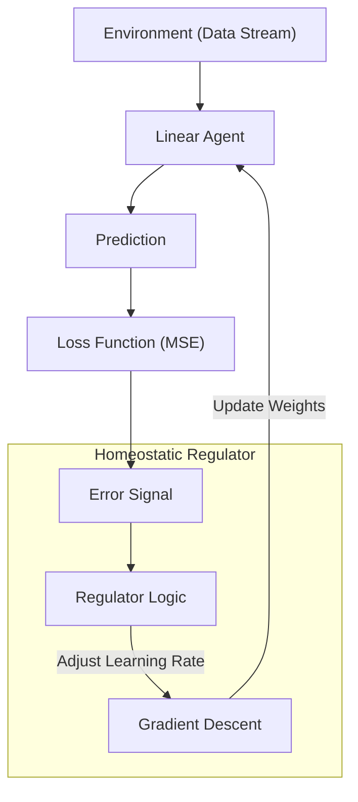

# Self-Regulating Learning System 🧠

> **A research-aligned prototype where the optimizer adapts to loss dynamics in real-time.**

## 📌 Overview
Traditional machine learning methods rely on fixed hyperparameters (like learning rate) or pre-defined schedules. This project implements a **Self-Regulating System** that dynamically adjusts its own learning strategy based on the feedback (loss) from the environment.

It models the interaction between a **Linear Agent** and a **Non-Stationary Environment**, mediated by a **Homeostatic Regulator**.

## 🧠 Architecture
The system follows a closed-loop control mechanism:



## 🛠 Project Structure
```bash
self-regulating-ai/
├── src/
│   ├── data_generator.py  # Synthesizes high-dimensional environmental data
│   ├── model.py           # The learning agent (Gradient Descent)
│   ├── regulator.py       # The control system (adjusts hyperparams)
│   └── main.py            # Simulation loop
├── experiments/           # Research experiments
├── requirements.txt       # Dependencies
└── README.md              # Documentation
```

## 🚀 How to Run
1. **Install Dependencies**
   ```bash
   pip install -r requirements.txt
   ```

2. **Run the Simulation**
   ```bash
   python -m src.main
   ```
   *Watch how the `Learning Rate` adapts as the `Loss` changes, stabilizing the system without manual tuning.*

## 🔬 Core Concept
The system uses an exponential decay feedback loop:

```math
LR_{t+1} = LR_t \times e^{-error \times \lambda}
```

This ensures that high error signals trigger a rapid stabilization response, while low error allows for fine-tuning.

## 👨‍💻 Author
**Farhan Muhammad Bashir**
*Researching autonomous adaptive systems.*

[](https://www.linkedin.com/in/farhan-rajput)

**Topics:** `machine-learning`, `adaptive-systems`, `homeostasis`, `python`, `autonomous-agents`, `research`
*Researching autonomous adaptive systems.*

---
*© 2026 All Rights Reserved.*
